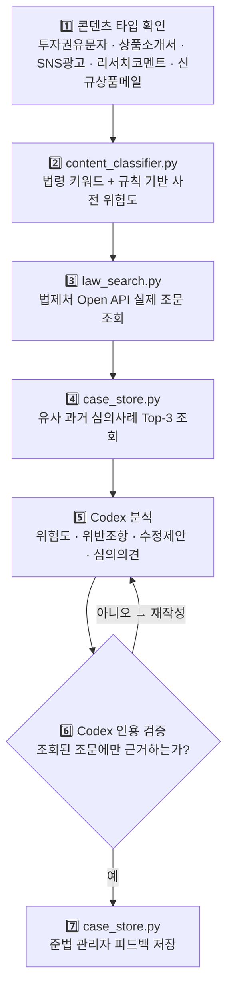

# 🛡️ 증권 투자권유·광고 준법 심의 Codex 플러그인

<p align="center">
  
  
  
  
</p>

> `src/` 전체가 Codex 플러그인 루트입니다. 배포 전 증권업 대고객 콘텐츠를
> 자본시장법·금융소비자보호법 기준으로 사전 심의하는 스킬을 담고 있습니다.

---

## 📑 목차
- [한 줄 요약](#-한-줄-요약)
- [누가, 언제, 어디서 막히는가](#-누가-언제-어디서-막히는가)
- [이 플러그인의 출발점](#-이-플러그인의-출발점)
- [동작 절차](#-동작-절차)
- [정보가 부족하거나 실패하는 상황에서의 동작](#-정보가-부족하거나-실패하는-상황에서의-동작)
- [구조](#-구조)
- [실행 방법](#-실행-방법)
- [검증 이력](#-검증-이력)
- [한계 및 다음 단계](#-한계-및-다음-단계)

---

## 🎯 한 줄 요약

카카오페이증권 마케팅/영업/디지털 채널 담당자가 투자권유 문자, 상품소개서,
SNS 광고 등을 고객에게 내보내기 전에, 자본시장법·금융소비자보호법상 부당권유·
광고 규제 위반 가능성을 **사전 심의**해주는 Codex 스킬입니다.

## 🚧 누가, 언제, 어디서 막히는가

| 구분 | 내용 |
| --- | --- |
| **누가** | 카카오페이증권 마케팅팀, 영업지원팀, 디지털 채널 담당자, 준법 관리자 |
| **어떤 상황** | 투자권유 문자(MTS/HTS 푸시), 펀드·ELS·해외주식 상품소개서, SNS 광고, 신규상품 안내 이메일을 고객에게 배포하기 직전 |
| **어디서 막히는가** | "원금보장", "확정수익"같이 **금융소비자보호법 제21조**(부당권유행위 금지)·**제22조**(광고 관련 준수사항)상 명백히 문제되는 표현조차 담당자 개인의 규제 지식에 의존해 걸러야 해서 심의 지연과 품질 편차가 생김. 일반 LLM에 그대로 검토를 맡기면 법령을 그럴듯하게 지어내는 환각 위험이 있음 |

## 🌱 이 플러그인의 출발점

새로 설계한 것이 아니라, JB금융그룹 Fin AI Challenge(지정주제: Compliance AI)에
제출했던 개인 프로젝트 [`JB-Compliance-Agent`](https://github.com/BaeYoungHwan/JB_LLM)의
**Retrieval → Analysis → Feedback** 3-Agent 구조를 증권업 투자권유·광고 규제에
맞게 재구성했습니다.

원본은 로컬 Ollama(EXAONE 3.5)와 ChromaDB를 별도 프로세스로 띄워 Analysis/
Retrieval Agent를 구현했지만, 이 제출물은 Codex 플러그인이므로 **Codex 자신이
Analysis Agent 역할을 직접 수행**하고, 법제처 API 조회·유사사례 검색처럼
결정론적인 부분만 스크립트로 분리했습니다. 무거운 로컬 LLM/벡터DB 설치 없이
`pip install -r src/skills/securities-compliance-review/scripts/requirements.txt`
만으로 평가자 환경에서 바로 실행되도록 하기 위한 선택입니다.

## 🔄 동작 절차

자세한 단계별 절차와 스크립트 호출 방법은
[`SKILL.md`](src/skills/securities-compliance-review/SKILL.md)에 있습니다.



1. **콘텐츠 타입 확인** — 투자권유문자 / 상품소개서 / SNS광고 / 리서치·투자자문
   코멘트 / 신규상품 안내 이메일
2. **`content_classifier.py`** — 법령 검색 키워드 + 규칙 기반 사전 위험도 조회.
   "원금보장"/"확정수익" 등은 LLM 판단 전에 규칙으로 먼저 `High`를 부여해,
   Codex가 명백한 위반을 과소평가하지 못하게 하는 안전장치
3. **`law_search.py`** — 법제처 Open API에서 실제 조문 조회
4. **`case_store.py`** — 과거 유사 심의 사례 Top-3 조회 (JSON 저장소, 시드 8건)
5. **Codex 분석** — 조회된 조문 범위 안에서만 위반 위험도/조항/수정 제안/심의
   의견 생성
6. **인용 검증** — Codex 스스로 인용한 법령이 3단계 조회 결과에 실제로
   있는지 재검증 (환각 방지)
7. **`case_store.py`** — 준법 관리자 피드백 저장 (저품질 피드백은 자동 거부)

## ❗ 정보가 부족하거나 실패하는 상황에서의 동작

| 상황 | 동작 |
| --- | --- |
| `LAW_API_KEY` 미설정 또는 법제처 API 호출 실패 | 심의를 중단하고 "근거 법령 조회 실패, 수동 검토 필요"로 표시. 위험도를 추정하지 않음 |
| 관련 조문이 검색되지 않음 | "근거 법령 없음, 수동 검토 필요"로 표시 |
| Codex가 조회되지 않은 법령을 인용하려는 경우 | 6단계 자체 검증에서 걸러내고 재작성 |
| 준법 관리자 피드백이 형식적(사유 없는 거절 등) | `case_store.py`가 저장을 거부 |
| 과거 유사 사례 없음 | "(유사 과거 사례 없음)"으로 표시하고 조문 근거만으로 진행 |

## 📁 구조

```
kakaopay-compliance/
├── README.md                      # 이 문서
├── logs/                          # AI 대화 로그 (log-hooks 자동 저장)
│   ├── claude-code/                #   Claude Code 세션 로그
│   └── codex/                      #   Codex CLI 세션 로그
├── .env.example                   # LAW_API_KEY 등 환경변수 예시
└── src/                           # Codex 플러그인 루트
    ├── .codex-plugin/
    │   └── plugin.json
    └── skills/
        └── securities-compliance-review/
            ├── SKILL.md            # 트리거 조건 + 절차 + 판단 기준
            ├── scripts/
            │   ├── content_classifier.py  # 콘텐츠 타입/키워드/사전위험도 규칙
            │   ├── law_search.py          # 법제처 Open API 래퍼 (CLI)
            │   ├── case_store.py          # 과거 사례 조회·저장 (CLI, JSON 기반)
            │   └── requirements.txt
            ├── references/
            │   └── 심의_기준.md    # 콘텐츠 분류, 법령 우선순위, 위험도 판정 기준
            └── data/
                └── cases.json      # 심의 이력 (시드 8건 + 누적)
```

## 🚀 실행 방법

```bash
pip install -r src/skills/securities-compliance-review/scripts/requirements.txt
cp .env.example .env   # LAW_API_KEY 입력 (https://open.law.go.kr 에서 발급)
```

Codex CLI에서 이 플러그인을 설치한 뒤, 증권업 투자권유 콘텐츠 심의를
요청하면 `securities-compliance-review` 스킬이 자동으로 트리거됩니다.
스크립트만 단독으로 검증하려면
`src/skills/securities-compliance-review/scripts/`에서 직접 실행할 수
있습니다 (SKILL.md의 2~4단계 명령어 참고).

> **🪟 Windows에서 `codex exec` 사용 시 주의**
> `--sandbox workspace-write`(비대화형 자동 승인 모드)로 실행하면 Codex의
> 제한된 샌드박스 토큰이 Windows에서 새 프로세스를 만들 로그온 세션을
> 확보하지 못해 `python.exe` 실행 자체가 "지정한 로그온 세션이 없습니다"
> 오류로 실패합니다 (Codex CLI 자체의 Windows 샌드박스 한계이며 이
> 프로젝트 코드 문제가 아닙니다). `--sandbox danger-full-access`로
> 실행하거나, 일반 대화형 세션에서 각 명령을 승인하며 실행해야 합니다.

## ✅ 검증 이력

- **`content_classifier.py`**: "원금 보장에 확정 수익 연 5%를 제공합니다"
  입력 → `preliminary_risk.risk = High` 정상 반환 확인 (스크립트 단독
  실행 및 Codex 플러그인을 통한 실행 양쪽 모두 확인)
- **`case_store.py query`**: 유사 사례 Jaccard 유사도 조회 정상 동작 확인
- **`case_store.py save`**: 저품질 피드백("거절" 5자 미만) 자동 거부, 정상
  피드백 저장 후 `cases.json`에 반영되는 것 확인
- **`law_search.py`**: `LAW_API_KEY` 미설정 시 위험도를 추정하지 않고
  즉시 오류 반환하는 것 확인. 이후 **실제 발급받은 키로 조문 조회까지
  완료** — `python law_search.py 자본시장법 금융소비자보호법` 실행 결과
  실제 조문 데이터가 정상 반환됨을 확인

<details>
<summary><strong>🔎 실제 조회로 조문 번호 오류 발견·수정 (가장 중요한 검증 결과)</strong></summary>

<br>

검증 과정에서 자본시장법 제49조(부당권유행위 금지)·제57조(투자광고)가
실제로는 **2020.3.24 삭제**되어 있음을 법제처 API 응답
(`"제49조 삭제 <2020.3.24>"`)으로 확인했습니다. 두 조항은 금융소비자보호법
제정과 함께 각각 **금융소비자 보호에 관한 법률 제21조**(부당권유행위 금지),
**제22조**(금융상품등에 관한 광고 관련 준수사항)로 이관되어 있었습니다.
README·SKILL.md·심의_기준.md·지원서 답변에서 옛 조문 번호를 인용한 부분을
모두 정정했습니다 — 실제 API로 검증하지 않았다면 삭제된 조문을 근거로
심의하는 프로젝트를 그대로 제출할 뻔한 사례입니다.

</details>

<details>
<summary><strong>🔌 Codex CLI 플러그인 설치·트리거 실검증 완료</strong></summary>

<br>

로컬 마켓플레이스로 `src/`를 플러그인 설치 후 "카카오페이증권 상품소개서
문안을 배포 전에 심의해줘: '이 상품은 원금 보장에 확정 수익 연 5%를
제공합니다.'" 요청 → `securities-compliance-review` 스킬이 자동
트리거되어 콘텐츠 타입 분류, `content_classifier.py` 실행(위험도 High),
법령 키워드 기반 웹 검색까지 이어지는 것을 확인했습니다. `LAW_API_KEY`
미설정 상태였음에도 Codex가 구체적 조문을 임의로 지어내지 않고 "반려
권고 · High" 판정과 함께 "구체 조항 확정은 준법 담당자의 수동 법령 확인
필요"로 명시한 것을 확인 — SKILL.md 6단계(인용 검증)의 환각 방지 원칙이
실제로 지켜졌습니다.

</details>

<details>
<summary><strong>🈺 Windows 콘솔 코드페이지(CP949) 인코딩 이슈</strong></summary>

<br>

콘솔 코드페이지가 949(CP949)인 Windows 환경에서 Codex가 PowerShell로
UTF-8 한글 소스 파일을 읽으면 표시가 깨지는 현상을 발견했습니다. `grep`으로
원본 바이트를 직접 확인한 결과 디스크상의 파일은 UTF-8로 정상이며, 콘솔
표시 레이어에서만 발생하는 문제임을 확인했습니다. 다만 이 표시 문제가
Codex의 법령명 해석 등 실제 판단에 영향을 주는지까지는 완전히 배제하지
못했습니다.

</details>

- 원본 JB-Compliance-Agent 검증 이력(P0 스모크 4/4, 콘텐츠 타입별 E2E 5종
  통과)은 Ollama/ChromaDB 기반 구버전 아키텍처 기준이라 이번 Codex 플러그인
  구조에는 직접 적용되지 않음 — 별도 재검증 필요

## 🧭 한계 및 다음 단계

- Codex가 실제 조문 조회 결과를 바탕으로 5~6단계(분석·인용 검증)를 수행하는
  전체 흐름은 `LAW_API_KEY` 발급 이후 아직 End-to-End로 재검증하지 못함 —
  이번에는 `law_search.py` 스크립트 단독 실행으로 API 연동만 확인했음
  (Codex 플러그인 트리거 자체는 키 미설정 상태에서 이미 검증됨)
- Windows에서 Codex 콘솔 코드페이지(CP949)로 인한 한글 파일 표시 깨짐이
  Codex의 실제 판단에 영향을 주는지 추가 확인 필요
- 이번에 발견한 조문 번호 오류(제49조·제57조 삭제)처럼, 법령은 개정으로
  조번이 바뀔 수 있으므로 `references/심의_기준.md`에 하드코딩된 조문
  번호도 주기적으로 재검증이 필요함
- `logs/` 폴더에 이 세션의 대화 로그가 원본 그대로 포함됐는지 제출 전
  확인 필요 (log-hooks 설치 이전 대화는 자동 캡처 대상이 아님)
